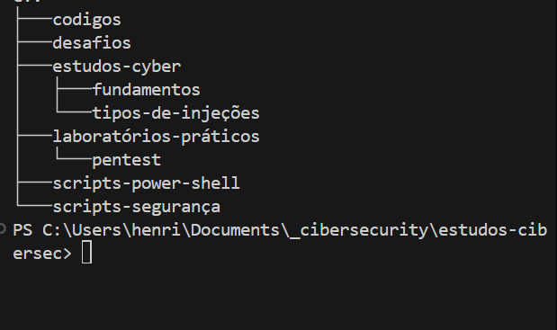

# Sobre Plano de Estudos Cibersegurança

## 1. Objetivo do Plano de Estudos
Este plano tem como foco construir uma base sólida em cibersegurança com aprendizado prático, documentação clara e evolução visível. A ideia não é apenas estudar, mas comprovar conhecimento técnico por meio de projetos, laboratórios e writeups públicos.

O plano prioriza:
- Mentalidade ofensiva e defensiva (Red Team / Blue Team)
- Aprendizado progressivo
- Registro do raciocínio técnico
- Construção de portfólio no GitHub

## 2. Público-Alvo e Nível Esperado
Indicado para quem já possui noções básicas de:
- Redes de computadores (TCP/IP, portas e protocolos)
- Sistemas Linux
- Git e GitHub
- Lógica de programação

Não é um plano para iniciantes absolutos, mas também não exige experiência avançada.

## 3. Metodologia de Estudo
O ciclo de estudo deve seguir a lógica:

Aprender → Praticar → Documentar → Revisar

- Teoria objetiva e focada
- Laboratórios práticos (CTFs, máquinas vulneráveis, labs)
- Documentação em Markdown
- Revisão constante de erros e aprendizados

A documentação faz parte do processo de aprendizado.

## 2. Utilize o Markdown (.md) para Documentar 
- O GitHub interpreta arquivos `.md` perfeitamente, permitindo formatação técnica, blocos de código e imagens. 
- **README.md**: Sempre inicie um repositório com um README claro, explicando o objetivo do projeto e as tecnologias utilizadas.
- **Estrutura de Writeup (CTF/Labs)**:
  - **Título/Nome do Desafio**
  - **Objetivo**: O que precisava ser explorado
  - **Metodologia/Passo a Passo**: Reconhecimento, varredura e exploração
  - **Comandos Utilizados**: Utilizar blocos de código (exemplo: ` ```bash `)
  - **Screenshots**: Evidências e provas de conceito (PoC)

## 3. O que incluir no Portfólio (Conteúdo)
- **Notas de Estudo** documentadas em Markdown
- **Resolução de CTFs** com explicação do raciocínio
- **Análise de Malware ou Vulnerabilidades** em ambientes controlados
- **Ferramentas e Scripts** para automação de tarefas de segurança

## 4. Boas Práticas e Dicas de Segurança
- **Nunca subir credenciais**: Utilize `.gitignore` para evitar o versionamento de senhas, tokens ou chaves de API
- **GitHub Issues**: Organize estudos, dúvidas e pendências
- **Frequência**: Commits regulares demonstram consistência
- **Vídeos**: Demonstrações curtas podem ser adicionadas ao README para projetos mais complexos

## 5. Dica de Ouro: Ferramentas Complementares
Ferramentas como o **Obsidian**, baseadas em Markdown, podem ser usadas para centralizar estudos e sincronizar automaticamente com o GitHub.

### Exemplo de estrutura de repositório
```text
.
├───codigos
├───desafios
├───estudos-cyber
│   ├───fundamentos
│   └───tipos-de-injeções
├───laboratórios-práticos
│   └───pentest
├───scripts-power-shell
└───scripts-segurança
```

