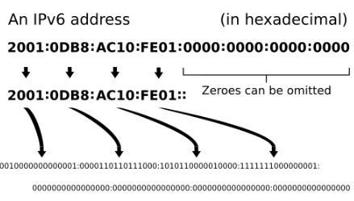

# O que é endereçamento IPv6?

O IPv6 (Internet Protocol version 6) é a nova geração do protocolo de comunicação da internet, desenvolvida para substituir o IPv4. Enquanto o IPv4 utiliza endereços de 32 bits (limitado a cerca de **4,3 bilhões** de dispositivos), o IPv6 utiliza **128 bits**, representados em formato hexadecimal. Isso permite uma quantidade virtualmente infinita de endereços únicos — aproximadamente 340 undecilhões — garantindo que cada dispositivo no planeta, desde smartphones até eletrodomésticos inteligentes, possa ter sua própria identidade na rede sem a necessidade de técnicas complexas como o NAT. Além da maior capacidade, o IPv6 traz melhorias nativas em segurança, eficiência de roteamento e autoconfiguração.

 

### Estrutura de um Endereço IPv6

 

 
*Fonte da imagem: [https://pt.wikipedia.org/wiki/Endereço_IPv6](https://pt.wikipedia.org/wiki/Endere%C3%A7o_IPv6)*

 

### Entendendo a Notação Hexadecimal

Diferente do seu antecessor que usava números decimais (0-255), o IPv6 utiliza o sistema **Hexadecimal** (0-9 e A-F).
*   **Composição:** O endereço é formado por 8 grupos (chamados de *hextetos*).
*   **Tamanho:** Cada grupo possui 16 bits (4 caracteres hexadecimais).
*   **Separador:** Os grupos são separados por dois pontos (`:`).

**Exemplo de endereço completo:**
`2001:0db8:85a3:0000:0000:8a2e:0370:7334`

 

### Regras de Abreviatura (Simplificando o Endereço)

Para tornar os endereços mais amigáveis para leitura humana, o IPv6 permite simplificações cruciais. É fundamental dominar essas duas regras:

**1. Omissão de Zeros à Esquerda**
Dentro de cada grupo, os zeros que aparecem no início podem ser removidos.
*   `0db8` vira `db8`
*   `0000` vira `0`
*   *Nota:* Zeros finais ou no meio do grupo NÃO podem ser removidos (ex: `85a3` continua `85a3`).

**2. Compressão de Zeros (::)**
Grupos contendo apenas zeros (`0000`) adjacentes podem ser substituídos por "dois pontos duplos" (`::`).
*   Esta regra só pode ser usada **uma vez** em todo o endereço para não perder a referência de quantos grupos foram suprimidos.

**Vamos praticar a simplificação:**
*   **Original:** `2001:0db8:0000:0000:0000:0000:1428:57ab`
*   **Regra 1 (Zeros à esquerda):** `2001:db8:0:0:0:0:1428:57ab`
*   **Regra 2 (Compressão ::):** `2001:db8::1428:57ab`

 

### Tipos de Comunicação no IPv6

O IPv6 elimina o antigo "Broadcast" e introduz conceitos mais eficientes:

| Tipo | Descrição | Analogia |
| :--- | :--- | :--- |
| **Unicast** | Um para Um (Ponto a Ponto). Comunicação direta entre dois dispositivos. | Uma ligação telefônica pessoal. |
| **Multicast** | Um para Vários. Envia pacotes para um grupo específico de interessados. | Uma aula para uma turma inscrita. |
| **Anycast** | Um para o "Mais Próximo". Envia para o servidor que responder mais rápido (ótimo para DNS). | Ligar para a emergência (atende a central mais perto). |

 

### Vantagens Práticas para o Futuro

1.  **Fim do NAT:** Cada dispositivo pode ter seu próprio IP público global (com firewall, claro). Isso facilita conexões P2P, jogos online e IoT.
2.  **Autoconfiguração (SLAAC):** Dispositivos podem gerar seus próprios endereços sozinhos ao se conectarem à rede, sem depender totalmente de um servidor DHCP.
3.  **Cabeçalho Otimizado:** Apesar do endereço ser maior, a estrutura do pacote é mais simples, permitindo que roteadores processem os dados mais rapidamente.

### Fontes e Materiais de Estudo

*   **Wikipedia:** [Endereço IPv6 - Definição e Detalhes Técnicos](https://pt.wikipedia.org/wiki/Endere%C3%A7o_IPv6)
*   **Documentação Oficial:** [RFC 8200 - Internet Protocol, Version 6 (IPv6) Specification](https://datatracker.ietf.org/doc/html/rfc8200)
*   **Portal Educativo:** [IPv6.br](https://ipv6.br/) - Iniciativa do NIC.br com cursos e guias em português.
*   **Livro:** *IPv6 Essentials: Integrating IPv6 into Your IPv4 Network* por Silvia Hagen.
*   **Vídeo:** [Explicação Visual do IPv6 (YouTube)](https://www.youtube.com/results?search_query=como+funciona+o+ipv6)
