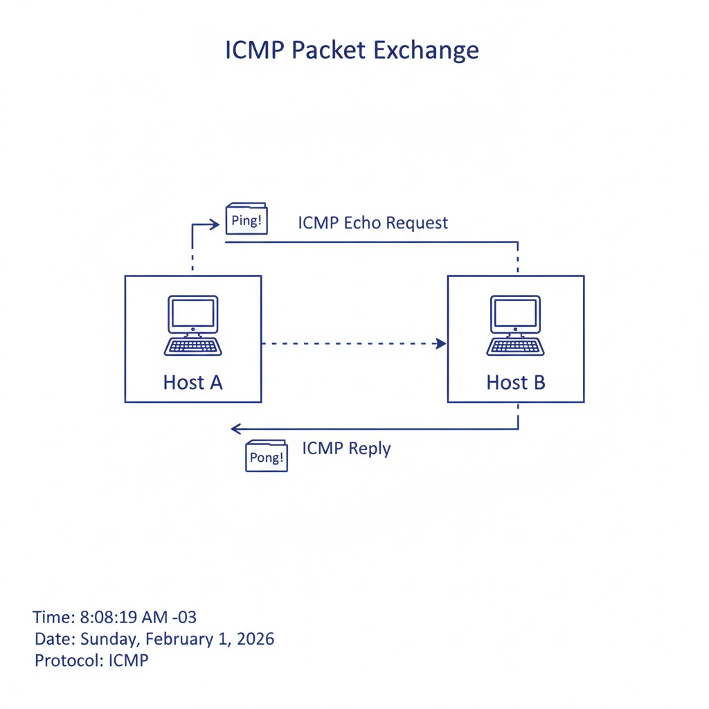
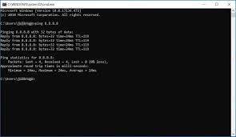

# Ping

O comando `ping` é uma ferramenta de diagnóstico de rede que envia pacotes ICMP (Internet Control Message Protocol) para um host de destino e mede o tempo que leva para receber uma resposta. Ele é usado para verificar a conectividade de rede e medir o tempo de resposta entre dois hosts. 

Apesar de simples, o `ping` é uma das primeiras ferramentas usadas por profissionais de redes, sysadmins e especialistas em cibersegurança para responder à pergunta básica: **“isso está acessível pela rede?”**.

> 📌 **Inserir imagem aqui:** Diagrama simples mostrando dois hosts trocando pacotes ICMP (Echo Request / Echo Reply).

---


### Funcionamento
O funcionamento baseia-se no envio de um pacote **ICMP Echo Request**. Ao receber esse pacote, o host de destino (caso não esteja configurado para ignorar requisições ICMP) responde com um pacote **ICMP Echo Reply**.

### Exemplos de Uso e Parâmetros
A sintaxe básica é `ping [host]`. Dependendo do sistema operacional, alguns parâmetros comuns incluem:

*   **Linux:**
    *   `-c <número>`: Define a quantidade específica de pacotes a enviar.
    *   `-i <segundos>`: Define o intervalo entre o envio de cada pacote.
    *   `-s <bytes>`: Especifica o tamanho do pacote de dados.
*   **Windows:**
    *   `-n <número>`: Define o número de requisições.
    *   `-t`: Realiza o ping continuamente até ser interrompido (Ctrl+C).
    *   `-l <bytes>`: Define o tamanho do buffer de envio.

Esse processo permite medir:
- Se o host está acessível
- Quanto tempo o pacote levou para ir e voltar
- Se há perda de pacotes no caminho

O `ping` não utiliza portas TCP ou UDP, pois o ICMP opera diretamente sobre o IP, o que o torna útil para testes iniciais de conectividade.



---

### Interpretação dos Resultados

Ao analisar a saída do comando, algumas métricas são fundamentais:

#### 1. RTT (Round-Trip Time)

Representa o tempo total, em milissegundos, que o pacote levou para sair da origem, chegar ao destino e retornar. Valores altos podem indicar latência de rede, roteamento ineficiente ou congestionamento.

#### 2. TTL (Time to Live)

O TTL é decrementado a cada salto (roteador) que o pacote atravessa. Quando chega a zero, o pacote é descartado. Esse valor pode ajudar a estimar a distância até o host e inferir o sistema operacional remoto de forma aproximada.

> 📌 **Inserir imagem aqui:** Representação visual do TTL diminuindo a cada salto.

#### 3. Perda de Pacotes (Packet Loss)

Indica a porcentagem de pacotes enviados que não receberam resposta. Perda frequente pode apontar problemas físicos, congestionamento, filtragem de ICMP por firewall ou hosts configurados para ignorar Echo Requests.

### Limitações e Considerações de Segurança

Muitos servidores bloqueiam ICMP por questões de segurança, podendo gerar falsos negativos.
Um host que responde a ping não garante que serviços TCP ou UDP estejam acessíveis.
Ataques como ICMP Flood utilizam o protocolo para causar negação de serviço, motivo pelo qual o ICMP é frequentemente filtrado.
O ping deve ser visto como um teste inicial, não como um diagnóstico completo.


### Abaixo estão alguns exemplos de uso do comando ping:    





# Hping, Hping3

O `hping` é uma ferramenta de análise de rede e segurança que permite enviar pacotes TCP/IP personalizados. Ele é uma alternativa mais poderosa ao `ping`, pois permite o envio de pacotes com diferentes flags TCP, tamanhos de payload e intervalos entre pacotes.    

Diferente do ping tradicional, o `hping3` não se limita ao protocolo ICMP, permitindo testar regras de firewall e a disponibilidade de serviços específicos ao manipular cabeçalhos de transporte.

### Principais Funcionalidades

*   **Teste de Firewall:** Verifica se portas específicas estão abertas ou se o firewall está filtrando pacotes com flags específicas (como SYN, ACK, FIN).
*   **Port Scanning:** Pode ser utilizado para realizar varreduras de portas de forma similar ao Nmap.
*   **Traceroute Avançado:** Permite realizar traceroute utilizando protocolos TCP ou UDP, o que é útil quando roteadores no caminho bloqueiam pacotes ICMP.
*   **Teste de Estresse:** Capaz de gerar uma grande carga de pacotes para testar a resiliência de um host ou rede (ex: SYN Flood).

### Exemplos de Comandos

*   **Enviar um pacote TCP SYN para a porta 80:**
    ```bash
    hping3 -S -p 80 <host>
    ```
*   **Realizar um scan de portas (1 a 1024):**
    ```bash
    hping3 --scan 1-1024 -S <host>
    ```
*   **Simular um ataque de inundação (Flood) para testes de carga:**
    ```bash
    hping3 --flood -S <host>
    ```
*   **Traceroute usando pacotes TCP na porta 443:**
    ```bash
    hping3 --traceroute -S -p 443 <host>
    ```

> ⚠️ **Aviso de Segurança:** Devido à sua capacidade de forjar pacotes e realizar ataques de negação de serviço, o `hping3` deve ser utilizado apenas em ambientes controlados ou redes onde você possui autorização expressa para testes de penetração.

# Discovery e Varredura Portuária Avançada

Uma varredura portuária avançada (ou **Advanced Port Scanning**) é uma técnica de segurança de rede utilizada para identificar portas de comunicação abertas, serviços ativos e vulnerabilidades potenciais em dispositivos conectados (servidores, firewalls, computadores) de forma mais detalhada e silenciosa do que a varredura convencional.

Diferente de um simples "ping" ou conexão direta, métodos avançados buscam mapear a superfície de ataque sem completar o "aperto de mão" (handshake) TCP, dificultando a detecção por sistemas de intrusão (IDS).

### Principais Técnicas e Métodos Avançados

As varreduras avançadas utilizam ferramentas como Nmap, RustScan ou hping para executar métodos específicos:

*   **TCP SYN Scan (Half-Open):** A técnica mais popular. Envia um pacote SYN (início de conexão), mas, ao receber a resposta SYN/ACK, envia um RST (reset) em vez de finalizar a conexão. É rápido e discreto.
*   **Stealth Scans (FIN, NULL, Xmas):** Enviam pacotes TCP com flags incomuns (ou sem flags, no caso do NULL) para explorar particularidades dos sistemas operacionais e contornar firewalls simples.
*   **UDP Scan:** Mais lento, porém crucial, pois verifica portas UDP (como DNS, SNMP, DHCP), muitas vezes ignoradas, mas frequentemente vulneráveis.
*   **Idle Scan (Varredura Ociosa):** Técnica extremamente furtiva que usa um "zumbi" (outra máquina na rede) para enviar os pacotes, ocultando o IP do atacante real.
*   **Version Detection & Fingerprinting (Detecção de Versão/OS):** Identifica não apenas que a porta 80 está aberta, mas qual software está rodando (ex: Apache 2.4.1) e o sistema operacional alvo.

### Objetivo da Varredura Avançada

*   **Reconhecimento (Reconnaissance):** Fase inicial de um pentest (teste de intrusão) ou ataque para mapear o ambiente.
*   **Identificação de Vulnerabilidades:** Localizar serviços desatualizados ou mal configurados que podem ser explorados.
*   **Análise de Firewall:** Testar se as regras do firewall estão eficientes ou se há portas ocultas expostas.
*   **Burlar Detecção:** Mimetizar tráfego legítimo para evitar alertas de segurança.

### Diferença entre Varredura Básica e Avançada

| Característica | Varredura Básica (ex: Connect Scan) | Varredura Avançada (ex: SYN/Stealth) |
| :--- | :--- | :--- |
| **Conexão TCP** | Completa (3-way handshake) | Parcial ou Nenhuma (Half-open/Raw) |
| **Detecção (IDS/Firewall)** | Alta (fácil de logar) | Baixa (furtiva) |
| **Velocidade** | Mais lenta | Muito rápida (ex: RustScan) |
| **Detalhes Obtidos** | Apenas porta aberta/fechada | Serviço, versão, SO, firewall |

> ⚠️ **Atenção:** Embora essencial para administradores de rede, a varredura avançada é frequentemente usada por agentes maliciosos para identificar pontos fracos, sendo considerada uma etapa de reconhecimento ativo.


# Exemplos de scripts para finalidades básicas de rede

## Pseudocódigo de verificação inicial de rede

> INÍCIO
Ao conectar ao Wi-Fi:
    Obter gateway padrão da rede
    Definir host de teste (gateway ou DNS público)

    Para N tentativas:
        Enviar pacote ICMP (ping)
        Medir tempo de resposta
        Se timeout:
            Registrar falha
        Senão:
            Registrar latência

    Calcular:
        Taxa de perda de pacotes
        Latência média

    Verificações básicas:
        Se gateway não responde:
            Alerta: possível problema de rede
        Se perda de pacotes > limite:
            Alerta: rede instável
        Se latência muito alta:
            Alerta: possível congestionamento ou interferência
        Se DNS não responde:
            Alerta: problema de resolução de nomes

    Exibir relatório simples ao usuário 

    FIM

## Implementação em Python

> import os 
  import time
  import platform  
  HOST = "8.8.8.8"
  ATTEMPTS = 4

    def ping(host):
        param = "-n" if platform.system().lower() == "windows" else "-c"
        command = f"ping {param} 1 {host}"
        return os.system(command) == 0

        success = 0                                                     

        print("Verificando segurança básica da rede...\n")

        for i in range(ATTEMPTS):
            if ping(HOST):
                print(f"Ping {i+1}: OK")
                success += 1
            else:
                print(f"Ping {i+1}: FALHA")
            time.sleep(1)

        loss = ((ATTEMPTS - success) / ATTEMPTS) * 100

        print("\nResultado:")
        print(f"Perda de pacotes: {loss}%")

        if success == 0:
            print("⚠️ Rede inacessível ou host não responde.")
        elif loss > 50:
            print("⚠️ Alta perda de pacotes detectada.")
        else:
            print("✅ Rede aparentemente estável.")

## Implementação em Power Shell

> $HOST = "8.8.8.8"
> $ATTEMPTS = 4
>
> function Test-Ping {
>     param(
>         [string]$Host,
>         [int]$Attempts
>     )
>
>     $success = 0
>
>     Write-Host "Verificando segurança básica da rede...`n"
>
>     for ($i = 1; $i -le $Attempts; $i++) {
>         if (Test-Connection -ComputerName $Host -Count 1 -Quiet) {
>             Write-Host "Ping $i: OK"
>             $success++
>         } else {
>             Write-Host "Ping $i: FALHA"
>         }
>         Start-Sleep -Seconds 1
>     }
>
>     $loss = (($Attempts - $success) / $Attempts) * 100
>
>     Write-Host "`nResultado:"
>     Write-Host "Perda de pacotes: $loss%"
>
>     if ($success -eq 0) {
>         Write-Host "⚠️ Rede inacessível ou host não responde."
>     } elseif ($loss -gt 50) {
>         Write-Host "⚠️ Alta perda de pacotes detectada."
>     } else {
>         Write-Host "✅ Rede aparentemente estável."
>     }
> }
>
> Test-Ping -Host $HOST -Attempts $ATTEMPTS


## Implementação em Bash

> #!/bin/bash
> HOST="8.8.8.8"
> ATTEMPTS=4
>
> echo "Verificando segurança básica da rede...\n"
>
> success=0
>
> for i in $(seq 1 $ATTEMPTS); do
>     if ping -c 1 $HOST > /dev/null 2>&1; then
>         echo "Ping $i: OK"
>         ((success++))
>     else
>         echo "Ping $i: FALHA"
>     fi
>     sleep 1
> done
>
> loss=$(( (ATTEMPTS - success) * 100 / ATTEMPTS ))
>
> echo "\nResultado:"
> echo "Perda de pacotes: $loss%"
>
> if [ $success -eq 0 ]; then
>     echo "⚠️ Rede inacessível ou host não responde."
> elif [ $loss -gt 50 ]; then
>     echo "⚠️ Alta perda de pacotes detectada."
> else
>     echo "✅ Rede aparentemente estável." 


## Implementação em Lua

> -- Lua script para ping básico
> local host = "8.8.8.8"
> local attempts = 4
> local success = 0
>
> print("Verificando segurança básica da rede...\n")
>
> for i = 1, attempts do
>     local cmd = "ping -c 1 " .. host
>     local f = io.popen(cmd)
>     local output = f:read("*a")
>     f:close()
>
>     if output then
>         print("Ping " .. i .. ": OK")
>         success = success + 1
>     else
>         print("Ping " .. i .. ": FALHA")
>     end
>     os.execute("sleep 1")
> end
>
> local loss = ((attempts - success) / attempts) * 100
>
> print("\nResultado:")
> print("Perda de pacotes: " .. loss .. "%")
>
> if success == 0 then
>     print("⚠️ Rede inacessível ou host não responde.")
> elseif loss > 50 then
>     print("⚠️ Alta perda de pacotes detectada.")
> else
>     print("✅ Rede aparentemente estável.")